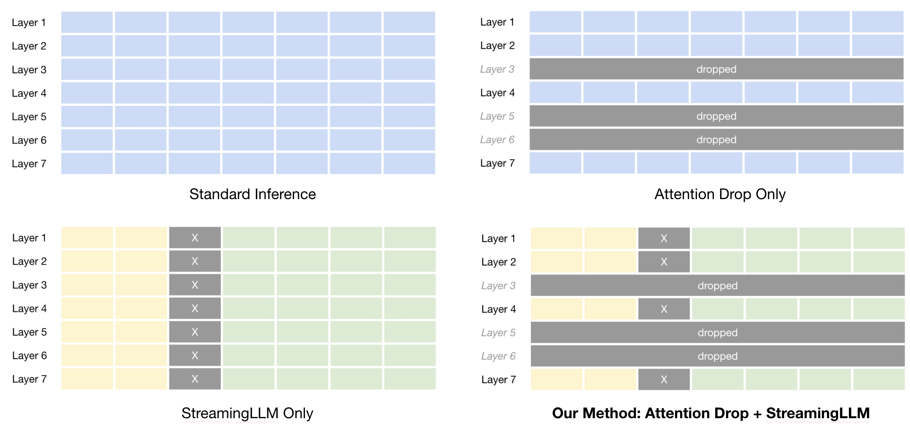
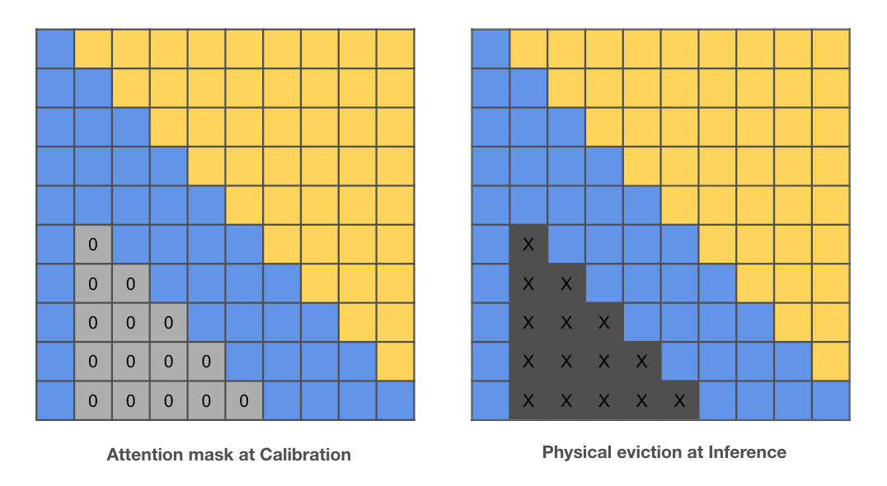

## Lightweight Streaming LLMs: Attention Layer Pruning for Memory-Efficient Long-Sequence Inference

**[Ashley Irawan](mailto:ashley.irawan@sjsu.edu), Kaikai Liu, Ph.D., Bernardo Flores, Ph.D.**

**This is the implementation of the paper _Lightweight Streaming LLMs: Attention Layer Pruning for Memory-Efficient Long-Sequence Inference_.** We combine [LLM-Drop](https://arxiv.org/abs/2406.15786)'s attention layer pruning with [StreamingLLM](https://arxiv.org/abs/2309.17453)'s KV cache bounding for memory-efficient long-sequence inference on constrained hardware. Code for the parent methods is based on [LLM-Drop](https://github.com/CASE-Lab-UMD/LLM-Drop) and [StreamingLLM](https://github.com/mit-han-lab/streaming-llm).

## Introduction



LLMs face two compounding memory bottlenecks during long-sequence inference: quadratic attention complexity and linear KV cache growth with sequence length. **LLM-Drop** prunes redundant attention layers entirely, reducing model depth and eliminating their associated KV cache entries. **StreamingLLM** bounds KV cache growth per layer by retaining only attention sink tokens and a rolling window of recent tokens. Despite their complementary nature, their combination had not been investigated.

In this work, we make three contributions: (1) we introduce **stream-aware calibration** — applying an attention mask during LLM-Drop's importance scoring to emulate the sparse attention pattern of StreamingLLM's KV cache eviction, ensuring pruning decisions are made under the same conditions the model 
operates in at inference time; (2) we evaluate attention layer pruning in the **long-text inference setting**, extending LLM-Drop's findings beyond downstream tasks — demonstrating that pruning alone consistently delivers 25% KV cache reduction and 1.16–1.17× throughput gains regardless of how the cache is bounded; and (3) we introduce the **Memory-Perplexity Degradation Ratio (MPDR)** µ to quantify the memory-perplexity tradeoff across all configurations.

For Llama 3-8B, combining streaming with 8-layer pruning achieves **25% KV cache reduction at a cost of only 1.21 perplexity points** (µ = 0.90) — the only configuration where memory savings proportionally exceed perplexity cost. For Mistral-7B, which natively bounds its KV cache via sliding window attention, pruning alone consistently delivers 25% KV cache reduction and ~1.17× throughput gains in the long-text inference setting.



## Quick Start

#### Installation

```bash
conda create -n llm-drop python=3.10
conda activate llm-drop

git clone https://github.com/AshleyEmily/Streaming-LLM-Drop
cd Streaming-LLM-Drop
pip install -e .
```

#### Requirements

```bash
pip install -r requirements.txt
```

## Run Pruning

#### Stream-Aware Layer Drop (recommended)
Calibrates importance scores under StreamingLLM's eviction pattern before pruning:
```bash
bash scripts/dropping/layer_drop.sh
```

#### Standard Layer Drop
```bash
bash scripts/dropping/layer_drop.sh
```

#### Block Drop
```bash
bash scripts/dropping/block_drop.sh
```

#### Joint Layer Drop
```bash
bash scripts/dropping/layer_drop_joint.sh
```

## Run Inference

#### Long-Sequence Perplexity (WikiText-2)
Evaluates perplexity over the full WikiText-2 test split (~300K tokens) with rolling KV cache eviction:
```bash
bash scripts/eval_long_ppl.sh
```

#### Standard Perplexity
```bash
bash scripts/eval_standard_ppl.sh
```

#### Streaming Baseline
```bash
bash scripts/eval_streamllm_baseline.sh
```

#### Prune and Evaluate (combined)
```bash
bash scripts/prune_and_eval.sh
```

## Benchmarks

#### Downstream Task Performance
Evaluates HellaSwag, MMLU, OpenBookQA, and WinoGrande:
```bash
bash scripts/benchmark/benchmark_lm_eval.sh
```

#### Throughput and Memory
Records peak GPU memory, KV cache footprint, and tokens/sec across configurations:
```bash
bash scripts/benchmark_inference.sh
```

#### Speedup
```bash
bash scripts/benchmark/benchmark_speed.sh
```

## Key Results

**Llama 3-8B** — no native KV cache bounding:

| Config | Drop | Window | PPL | Tok/s | Peak KV (MiB) | µ |
|---|---|---|---|---|---|---|
| Streaming | 0 | 4096 | 5.36 | 30.5 | 512 | — |
| Streaming + Pruning | 8 | 4096 | 6.57 | 36.3 | 384 | **0.90** |
| Streaming + Pruning | 8 | 8192 | 6.76 | 27.4 | 768 | 0.95 |
| Streaming + Pruning | 12 | 8192 | 8.96 | 31.2 | 640 | 1.71 |

**Mistral-7B-v0.1** — native sliding window attention:

| Config | Drop | Window | PPL | Tok/s | Peak KV (MiB) | µ |
|---|---|---|---|---|---|---|
| Standard | 0 | 4096 | 4.68 | 32.5 | 512 | — |
| Pruning only | 8 | 4096 | 6.10 | 37.9 | 384 | 1.21 |
| Streaming + Pruning | 8 | 4096 | 6.30 | 33.8 | 384 | 1.45 |

µ (MPDR) = ∆PPL% / ∆Mem%. Lower is better; µ < 1 means memory savings exceed perplexity cost.

## Citation

```bibtex
@article{irawan2026lightweightstreaming,
      title={Lightweight Streaming LLMs: Attention Layer Pruning for Memory-Efficient Long-Sequence Inference},
      author={Ashley Irawan and Bernardo Flores and Kaikai Liu},
      year={2026}
}
```

## Contact

- Ashley Irawan: ashley.irawan@sjsu.edu
